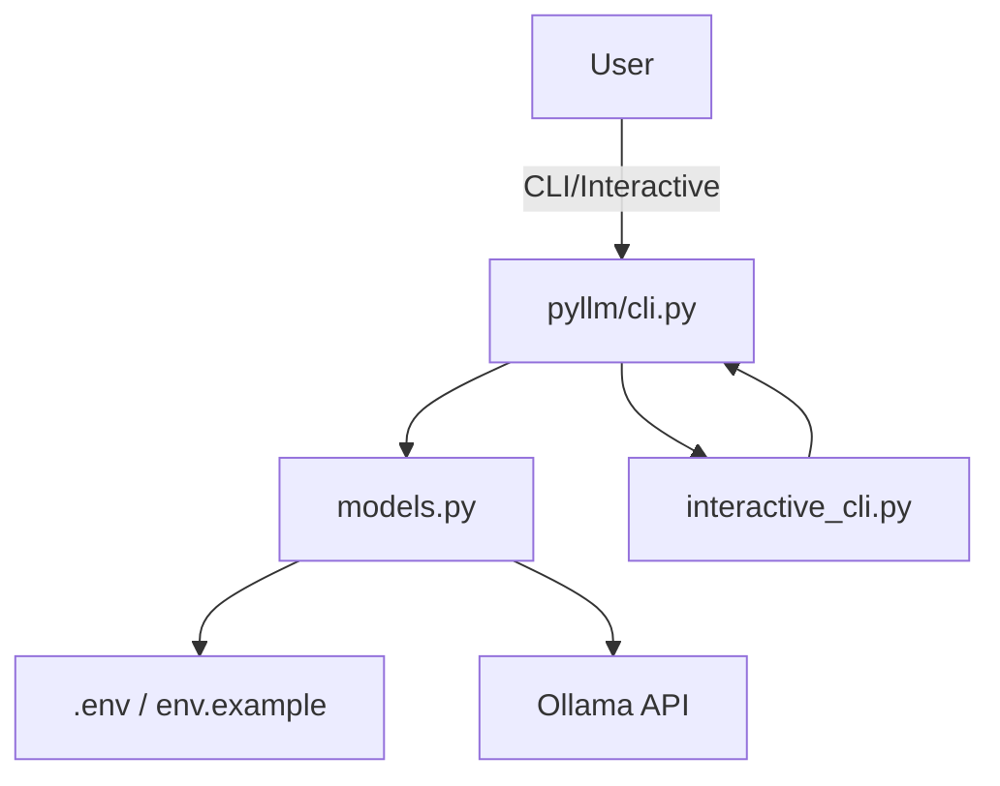
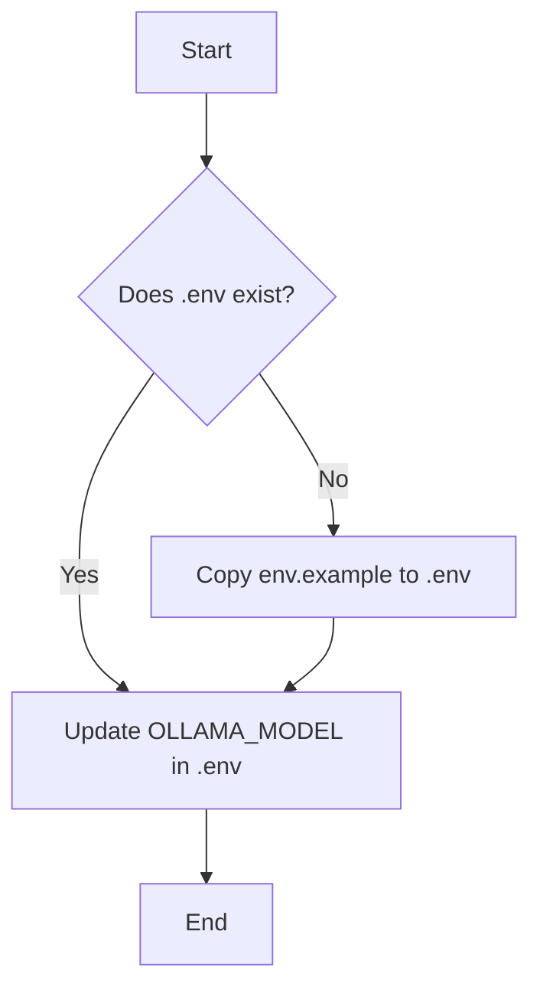

# pyllm

pyllm is a CLI tool for managing LLM models with Ollama integration. It allows you to install, list, set the default model, and update the model list. Both standard CLI and interactive shell modes are available.

---

## General Diagram (Mermaid)


---

## ASCII Diagram: CLI Command Flow
```
User
    |
    v
+-----------------+
|   pyllm CLI     |
+-----------------+
    |
    v
+-----------------+
|   models.py     |
+-----------------+
    |
+-----------------+
| .env/.example   |
+-----------------+
    |
+-----------------+
|  Ollama API     |
+-----------------+
```

---

## Modes

- **CLI**: `pyllm <command>`
- **Interactive**: `pyllm -i` or `pyllm interactive`

---

## Key Files

- `pyllm/cli.py` – main CLI
- `pyllm/interactive_cli.py` – interactive shell with menu and cursor selection
- `pyllm/models.py` – model logic, .env/env.example handling, Ollama integration
- `.env`/`env.example` – environment config and default model

---

## Example Usage

### List available models
```bash
pyllm list
```

### Install a model
```bash
pyllm install deepseek-coder:6.7b
```

### Set default model
```bash
pyllm set-default deepseek-coder:6.7b
```

### Show default model
```bash
pyllm default
```

### Update model list from Ollama
```bash
pyllm update
```

### Run interactive mode (menu, cursor selection)
```bash
pyllm -i
```

---

## set_default_model function flow (Mermaid)


---

## Interactive mode - menu (ASCII)
```
+--------------------------------+
|  pyllm - interactive mode       |
+--------------------------------+
| > List available models         |
|   Show default model           |
|   List installed models        |
|   Install model                |
|   Set default model            |
|   Update model list            |
|   Test default model           |
|   Exit                         |
+--------------------------------+
  (navigation: arrow keys + Enter)
```

---

## Installation

```bash
pip install pyllm
```

## Usage

```python
from pyllm import get_models, get_default_model, set_default_model, install_model

# Get available models
models = get_models()
for model in models:
    print(f"{model['name']} - {model.get('desc', '')}")

# Get the current default model
default_model = get_default_model()
print(f"Current default model: {default_model}")

# Set a new default model
set_default_model("codellama:7b")

# Install a model
install_model("deepseek-coder:6.7b")
```

## Environment Variables

The package uses the following environment variables:

- `OLLAMA_MODEL`: The default model to use with Ollama

## License
This project is licensed under the Apache 2.0 License (see LICENSE file).
